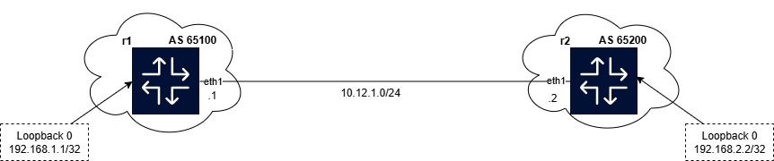

# Lab 04 — BGP Basics

**Author:** Baltej Giri  
**Repo:** [https://github.com/baltejgiri/my-labs](https://github.com/baltejgiri/my-labs)  
**Reference:** [Arista EOS BGP Documentation](https://www.arista.com/en/um-eos/eos-border-gateway-protocol)

---

## Topology




## BGP Session

| | R1 | R2 |
|---|---|---|
| Type | eBGP | eBGP |
| ASN | 65100 | 65200 |
| Neighbour IP | 10.12.1.2 | 10.12.1.1 |
| Advertises | 192.168.1.1/32 | 192.168.2.2/32 |

## Important — Arista EOS Requirement

`service routing protocols model multi-agent` must be the first line in the configuration on every router before BGP is configured. Without this BGP will not function correctly on Arista EOS.

## Learning Objectives

1. Understand eBGP session establishment between two different ASNs
2. Verify BGP neighbour states progress to Established
3. Advertise loopback prefixes into BGP
4. Verify routes are received and installed in the routing table
5. Understand BGP router-id selection and best practice

## Verification Commands

```bash
# BGP session summary — confirm Established and prefixes received
show bgp summary

# Detailed neighbour information
show bgp neighbors 10.12.1.2

# Routes advertised to the peer
show bgp neighbors 10.12.1.2 advertised-routes

# Routes received from the peer
show bgp neighbors 10.12.1.2 received-routes

# Full BGP table
show ip bgp

# BGP routes installed in routing table
show ip route bgp
```

## Expected Output

```
R1# show bgp summary

Neighbor    AS      MsgRcvd  MsgSent  Up/Down    State/PfxRcd
10.12.1.2   65200   5        5        00:01:23   1
```

`1` in State/PfxRcd confirms R1 received one prefix from R2 — the 192.168.2.2/32 loopback.

```
R1# show ip route bgp
B E   192.168.2.2/32 [200/0] via 10.12.1.2, Ethernet1
```

`B E` = BGP eBGP route installed in the routing table.

## BGP Neighbour States

| State | Meaning |
|-------|---------|
| Idle | BGP not started or TCP failed |
| Connect | TCP SYN sent, waiting for response |
| Active | TCP failed, retrying — most common stuck state |
| OpenSent | BGP OPEN message sent, waiting for peer OPEN |
| OpenConfirm | OPEN received, waiting for KEEPALIVE |
| Established |  Session up — UPDATE messages flowing |

> **Stuck in Active** is the most common BGP issue. Check: wrong neighbour IP, wrong ASN, ACL blocking TCP port 179, or no route to peer.

## Break/Fix Scenarios

### Scenario A — Wrong ASN

```bash
# Break it on R1
neighbor 10.12.1.2 remote-as 99999

# Expected symptom
show bgp neighbors 10.12.1.2   ← look for OPEN error, AS mismatch

# Fix
neighbor 10.12.1.2 remote-as 65200
```

### Scenario B — Wrong Neighbour IP

```bash
# Break it on R1
no neighbor 10.12.1.2 remote-as 65200
neighbor 10.12.1.99 remote-as 65200

# Expected symptom
show bgp summary   ← State = Active (TCP connection fails)

# Fix
no neighbor 10.12.1.99 remote-as 65200
neighbor 10.12.1.2 remote-as 65200
```

### Scenario C — Authentication Mismatch

```bash
# Break it — add password on R1 only
neighbor 10.12.1.2 password arista

# Expected symptom
show bgp neighbors 10.12.1.2   ← session drops, MD5 failure

# Fix option 1 — match on R2
neighbor 10.12.1.1 password arista

# Fix option 2 — remove from R1
no neighbor 10.12.1.2 password
```

### Scenario D — Remove Network Advertisement

```bash
# Break it on R1
no network 192.168.1.1/32

# Expected symptom
R2# show ip bgp   ← 192.168.1.1/32 is gone from BGP table

# Fix
network 192.168.1.1/32
```